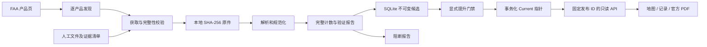

# 本机研究架构

系统区分官方原件、解析结果、验证报告和已提升的发布集。解析成功只说明已实现检查通过，不能表示运行级适航性。

## 组件

- flightmap_schema：来源、产品权限、原件、发布、记录溯源、报告及导入清单。
- flightmap_storage：SQLite 编号迁移、不可变资产/候选、提升、撤销、版本读取和差异报告。
- flightmap_ingestion：产品发现、下载、NASR/d-TPP 解析、CIFP 结构读取、IF/TF 引擎、CLI。
- flightmap_api：读取版本化数据；不提供写入、静态数据库或原件下载入口。
- web：React/MapLibre，固定产品发布 ID，显式选择历史/预览，同机场航图目录及原生 PDF 面板。

本机只运行 API 和前端。PostGIS、MinIO、瓦片导出和云部署保留为未来独立需求，infra/compose.yml 是旧方案参考，不是本版依赖。

## 存储

原件按内容哈希去重，获取事件分别保留 URL、最终 URL、时间、类型和产品身份。发布通过多对多输入关系引用原件；每条记录包含资产哈希及文件成员/行号/定位信息。

发布 ID 固定后内容不可替换。同周期更正生成新发布；SQLite 事务只替换对应产品的 Current 指针。失败不会切换指针，撤销不会自动回退到旧版本。

验证报告分别记录成功、不支持和错误，三者之和必须等于输入数。已知不支持项保留原因；真实解析错误阻断整个受影响发布。原始记录数不必等于输出实体数，例如一个结构记录可能派生多个研究对象，必须由解析器报告解释计数。

## 有效期与版本

AIRAC 日历用于周期标签。产品有效期只能来自本产品证据；d-TPP XML 直接给出带 UTC 时刻的区间，NASR EFF_DATE 单独不足以证明精确时间。

Current API 每次验证产品权限、验证报告、精确区间和当前指针，并在返回前复查版本。接口不缓存默认数据。所有查询均要求 release_id；更新冲突返回409，过期/撤销返回410。

未来已验证候选可显式 preview；过期或已被替换的版本可显式 history。有效期内从未提升的候选不能借 history 绕过提升。撤销数据在所有模式拒绝访问。

前端先取一次产品发布快照，再固定各 release_id。到期、失去连接、版本冲突、窗口返回前台或系统唤醒时清理默认航空数据并重新读取。历史与预览保持醒目标识；不将最新航图自动配给旧周期程序。

## 几何与关联

IF 为唯一确认点；TF 必须与同分支紧邻原始 IF/TF 相连。引擎检查原件/成员一致、源行号严格递增、引用唯一；未知腿或其他分支打断连接。TF 用 GeographicLib WGS84 名义测地线，每段不超过一海里，跨180度拆段，不预测完整转弯轨迹。

当前 CIFP 只有结构读取依据，未验证的点不标记 unique、未核实的分支不赋值，候选报告保持阻断。d-TPP 航图与程序是不同对象；没有充分标识规则时，只显示同机场同周期目录供人工选择，不自动猜测关联。
