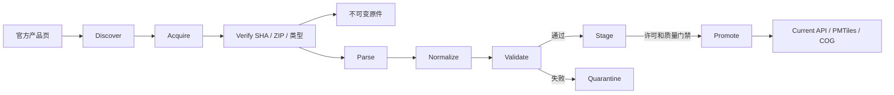

# 架构

## 信任边界

系统把“官方文件”和“解析结果”视为不同对象。解析成功不能证明数据正确；只有通过许可、完整性、语义、跨源和有效期门禁的发布集才能成为 Current。

## 组件

- `packages/schema`：AIRAC、来源、原始资产、发布集、覆盖和问题的数据契约。
- `services/ingestion`：官方页面发现、资产下载、完整性检查与管线状态机。
- `services/api`：只返回当前且已验证数据的只读接口。
- `apps/web`：MapLibre 地图、覆盖状态、来源审计及未来的程序/PDF 对照界面。
- `sources`：机器可读来源、许可和发现配置。
- `infra`：PostGIS 用于规范化与空间 QA，MinIO 用于不可变原件和地图产物。

## AIRAC 状态

有效区间统一为 `[valid_from, valid_to)`。Preview 可以提前采集和验证，但生效前不能进入默认 API。切换采用版本化发布集和 Current 指针；新周期失败时不延长旧周期，旧数据到期即停止返回。

## 后续实现

下一阶段将增加 FAA CIFP 解析适配器、数据库迁移、发布集仓库和 PMTiles/COG 导出。程序腿几何按 Path Terminator 支持矩阵逐项实现和核图。
